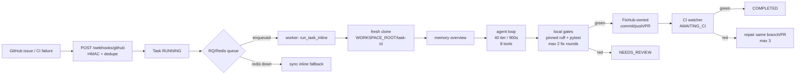

# FixHub

[](https://github.com/Fazalsh2909/Fixhub/actions/workflows/ci.yml)
[](LICENSE)


GitHub-issue and CI-failure coding agent: webhook trigger → queued agent run → sandboxed LLM tool loop → local gate check → FixHub-owned commit/push → pull request → IDE review.

This README documents the **current implementation as frozen**. No deployed demo exists; all URLs below are local (`localhost`). Screenshots referenced in `docs/` are local/demo screenshots where present.

## What FixHub does (demonstrated behavior)

- Listens for `issues.opened/reopened` and failed `workflow_run` / `check_run` events on `POST /webhooks/github` (`backend/app/github/webhook.py`). Verifies `sha256=` HMAC, dedupes by delivery ID, creates a `Task` with status `RUNNING`.
- Enqueues the run on RQ/Redis (`backend/app/tasks/queue.py`). When `AUTO_RUN_ON_WEBHOOK=0`, it only creates the task; run it via `POST /api/tasks/{id}/run`. `?sync=true` runs inline for tests and local dev without Redis.
- Runs one attempt per task with no hidden retries (`backend/app/tasks/service.py:run_task_inline`). Fresh clone to `WORKSPACE_ROOT/task-{id}` → repository memory overview → agent loop → local gates → review → FixHub-owned git publish → PR.
- The agent loop (`backend/app/agent/loop.py`) is bounded: 40 iterations, 900s runtime, 8 rewrites per path, duplicate/failure policy per tool call, user-cancel polling. Tools (8 total, `backend/app/agent/tools.py`): `list_directory`, `read_file`, `search_code`, `write_file`, `edit_file`, `run_command`, `git_status`, `git_diff`. All paths are repository-relative and jailed (`backend/app/agent/paths.py`); sensitive files (`.env`, `*.pem`, `*.key`, secrets/tokens/credentials) are blocked.
- Commands run sandboxed (`backend/app/sandbox/sandbox.py`): fixed cwd inside the workspace, wall timeout, output cap, env scrub (`LLM_API_KEY`, `GITHUB_APP_PRIVATE_KEY`, `GITHUB_TOKEN`, `GH_TOKEN`), secret redaction registry, destructive-pattern denylist, process-tree kill on timeout.
- Local gates before any push (`backend/app/verify/gates.py`): repo-pinned `ruff check` + `ruff format --check` on changed Python files, plus the repo's exact CI test commands (allowlisted to test/lint/typecheck/format only). Up to 2 agent fix rounds; persistent red goes to `NEEDS_REVIEW` instead of a red PR.
- FixHub owns git (`backend/app/github/publisher.py`): the LLM never branches/commits/pushes. One task = one workspace = one branch = one PR. Branches are deterministic per task: `fixhub-fixes/issue-<n>-task-<id>` and `fixhub-fixes/ci-<shortsha>-task-<id>`. A collision guard fails loudly (`branch_collision`) instead of last-writer-wins. `__pycache__` output is excluded from diffs and commits.
- Post-publish CI watcher (`backend/app/tasks/ciwatch.py`): published PRs enter `AWAITING_CI`. A 60s in-process tick (plus manual `POST /api/cron/ci-watch`) completes the task on green checks or enqueues a repair round on the same task/branch/PR (max 3, then `FAILED`).
- Waste guards: duplicate CI deliveries for an already-`RUNNING` repo+sha+job reuse the active task; a pre-agent check and a pre-publish check skip runs when a green FixHub PR already touches the same files (`SUPERSEDED`).
- Memory (`backend/app/memory/store.py`, `memories` table) is token-overlap `LIKE` search over path+summary (no embeddings). It is injected as background prior knowledge and written only from real diffs plus the agent summary. The prompt instructs the model to verify memory against files.
- Task statuses observed in code: `RUNNING`, `NEEDS_REVIEW`, `AWAITING_CI`, `CANCELLED`, `COMPLETED`, `FAILED`, `BLOCKED`. `BLOCKED` means missing key, unreachable gateway, or no clone source. `FAILED` means agent crash, limits exceeded, publish failure, or exhausted CI repairs.



## Measured results (not marketing claims)

- **Live GitHub run (observed 2026-09-29):** probe breakage on branch `live-e2e-test` of `Fazalsh2909/nexus-mcp-intelligence` (off-by-one in `apps/api/app/core/pagination.py` + probe test), CI failed (`assert 3 == 4`). FixHub task #20 loaded CI context, checked out the failing SHA, made a one-line ceiling-division fix, ran pytest + pinned ruff 0.8.0 + mypy locally, pushed `fixhub-fixes/ci-ce814b9-task-20`, opened PR #11 (first and only PR for the task), watcher observed green checks → `COMPLETED`. About 20 minutes wall time (dominated by free-tier LLM latency), 12 tool calls, 31 events. Trace: `docs/examples/real-ci-repair-trace.md`. PR: <https://github.com/Fazalsh2909/nexus-mcp-intelligence/pull/11> (public at time of writing). A live repair round on real GitHub was **not** observed; repair is covered by unit/mocked tests only.
- **Deterministic benchmark:** `backend/tests/benchmark/` (runner + 17 scenarios + committed `results/baseline.json`). Baseline: **17/17 pass, 0 unexpected failures** — 11/11 bug-fix, 3/3 safe-failure, 3/3 reliability probes. Averages: 4.8 steps (median 4), 4.1 tool calls, 2.7s runtime. PR creation alone never counts; success requires the real fix plus passing validation on a fresh clone. See `docs/BENCHMARK.md`.
- **Test suite:** backend `pytest` suite green (117 passed at last full validation per `docs/FINAL_ENGINEERING_REPORT.md`), no keys needed. Covers e2e (`test_e2e.py`), queue fallback (`test_queue.py`), IDE approve flow (`test_ide.py`), concurrency/branch isolation (`test_concurrency.py`), gates, sandbox/tools, memory, webhook, reliability probes. Frontend: `tsc --noEmit` + `vite build` clean.

Full limitations are listed in [Known limitations](#known-limitations) below and in `docs/FINAL_ENGINEERING_REPORT.md`.

## 5-minute quickstart (Docker, supported install)

Prerequisites: Docker + Docker Compose, a GitHub App (for live runs), an OpenAI-compatible LLM key.

```powershell
copy backend\.env.example backend\.env
# fill BYNARA_API_KEY (or XKIRO_API_KEY) + GITHUB_APP_ID + GITHUB_WEBHOOK_SECRET in backend\.env
# put your GitHub App .pem next to backend\.env, set GITHUB_APP_PRIVATE_KEY_PATH=./fixhub-app.pem

docker compose up --build
```

Local endpoints (all local, no deployed demo):

| Service  | Docker host URL            | Local-dev URL              |
| -------- | -------------------------- | -------------------------- |
| Backend health | http://localhost:8001/health | http://localhost:8000/health |
| Frontend IDE   | http://localhost:8080      | http://localhost:5173 (`npm run dev`) |
| Tasks API      | http://localhost:8001/api/tasks | http://localhost:8000/api/tasks |
| Queue health   | http://localhost:8001/api/queue/health | http://localhost:8000/api/queue/health |

Note: `docker-compose.yml` maps host `8001` to container `8000` because port 8000 was already taken on the author's machine. `frontend/vite.config.ts` dev proxy and `frontend/nginx.conf` both target backend port `8000` (container name `backend` in Docker, `localhost` in dev).

Services: `backend` (API) + `worker` (RQ agent runs) + `redis` (queue) + `frontend` (IDE). Scale workers: `docker compose up --scale worker=3` (multi-worker load is untested; branch isolation makes it safe by construction, not by proof).

Wipe per-task sandboxes and local state:

```powershell
docker compose down -v
```

## GitHub App setup (live runs)

1. Create a GitHub App. Permissions: Contents read/write, Issues read, Pull requests read/write, Actions read, Checks read.
2. Set webhook URL to `https://<your-public-host>/webhooks/github` and generate a webhook secret.
3. Install the app on your test repo (`owner/repo`).
4. In `backend/.env`: `GITHUB_APP_ID=<app-id>` (App ID, not installation ID), `GITHUB_APP_PRIVATE_KEY_PATH=./fixhub-app.pem` (mounted file; never inline multiline PEM), `GITHUB_WEBHOOK_SECRET=<same-secret-as-github>`.
5. Record the installation ID in the `repositories` table for `owner/repo` (webhook auto-creates the repo row without it; without it runs stop at `BLOCKED: no clone source`):
   ```sql
   UPDATE repositories SET installation_id='<install-id>' WHERE github_full_name='owner/repo';
   ```
   Or connect via the IDE Repositories panel / `POST /api/repositories/connect`. See `docs/SETUP.md`.

## IDE (local UI)

`http://localhost:8080` in Docker (or `:5173` via `npm run dev`): task list, per-task Explorer, Monaco editor with multi-tab open/save (`Ctrl+S`), TraceView (agent steps, live SSE + poll fallback), Diff/Proof, ReviewPanel (Enqueue / Run now / Approve & Commit), chat notes, per-repo Issues tab with manual **Fix** buttons, Repositories panel (installations with one-click Connect plus manual owner/repo form for forks/OSS).

Backend IDE APIs (all scoped to a task workspace with the same path/sensitive-file guards as agent tools, `backend/app/api/ide.py`):

- `GET /api/tasks/{id}/files?path=.` · `GET /api/tasks/{id}/file?path=…` · `PUT /api/tasks/{id}/file`
- `GET /api/tasks/{id}/diff` · `GET /api/tasks/{id}/events?after=` · `GET /api/tasks/{id}/verification`
- `POST /api/tasks/{id}/terminal` · `POST /api/tasks/{id}/chat` · `GET /api/tasks/{id}/chat/stream` (SSE)
- `POST /api/tasks/{id}/approve` · `GET /api/queue/health`

Full reference: `docs/API.md`.

## Local dev (no Docker)

```powershell
cd backend
python -m venv .venv; .\.venv\Scripts\Activate
pip install -r requirements.txt
copy .env.example .env
# set WORKSPACE_ROOT=./workspaces for local runs
# optional: run redis locally or use ?sync=true (inline fallback needs no Redis)
python -m pytest tests/ -q
python -m uvicorn app.main:app --port 8000
# worker (needs Redis): python -m app.tasks.worker
```

Frontend dev:

```powershell
cd frontend
npm install
npm run dev   # http://localhost:5173, proxies /api to localhost:8000
npm run build # tsc --noEmit + vite build -> dist/ (served by nginx in Docker)
```

## Tests (no keys needed)

```powershell
cd backend
python -m pytest tests/ -q
python tests/benchmark/runner.py   # 17-scenario deterministic benchmark
```

`test_e2e.py` proves issue → scripted agent (read→edit→run→finish) → commit → push to per-task branch → events + memory. `test_queue.py` proves webhook auto-enqueue + Redis fallback. `test_ide.py` proves `NEEDS_REVIEW` → Approve & Commit + IDE file/diff/terminal guards. `test_concurrency.py` proves workspace/branch isolation + `branch_collision` fail-loud.

## Config reference

See `backend/.env.example` and `backend/app/config.py`. Key notes:

- Provider switch `LLM_PROVIDER=bynara|xkiro` (both OpenAI-compatible, must support `tools` + `tool_choice`). Defaults: `router.bynara.id` / `nemotron-3.5-lightning-free`, `api.xkiro.com` / `qwen/qwen3-coder-plus:free`. Legacy `LLM_API_KEY`/`LLM_BASE_URL`/`LLM_MODEL` trio wins when set (backward compat + tests).
- Budgets: `LLM_MAX_ITERATIONS=40`, `LLM_MAX_RUNTIME_S=900`, `JOB_TIMEOUT_S=1200`, `COMMAND_TIMEOUT_S=180`, `LLM_MAX_REWRITES_PER_PATH=8`, `LLM_HISTORY_GROUPS=12`.
- `WORKSPACE_ROOT=/tmp/fixhub-workspaces` in Docker, `./workspaces` locally. `WORKSPACE_KEEP=0` removes task dirs after terminal states; `1` keeps for debugging.
- `REDIS_URL=redis://redis:6379/0` in Docker, `redis://localhost:6379/0` locally. `QUEUE_NAME=fixhub`.
- `AUTO_RUN_ON_WEBHOOK=1` auto-enqueues on webhooks; `AUTO_PUBLISH=1` publishes immediately, `0` stops at `NEEDS_REVIEW` for IDE approval.
- Never commit `backend/.env`, `*.pem`, `*.key`, or `*.db` (all gitignored, see `.gitignore`).

## Project layout

```text
backend/app/agent/loop.py, tools.py, paths.py, prompt.py, context.py  # bounded tool loop (8 tools)
backend/app/sandbox/sandbox.py                                        # denylist + env scrub + tree-kill
backend/app/github/webhook.py, publisher.py, client.py, app_auth.py   # HMAC + dedupe + FixHub-owns-git
backend/app/tasks/service.py, queue.py, worker.py, ciwatch.py         # one attempt + RQ + 60s CI watcher
backend/app/verify/gates.py                                           # pinned ruff + exact CI pytest commands
backend/app/memory/store.py                                           # LIKE-based prior knowledge (no embeddings)
backend/app/repo/workspace.py                                         # WORKSPACE_ROOT/task-{id} fresh clones
backend/app/api/ide.py + app/main.py                                  # task-scoped IDE APIs + routers
backend/tests/ (test_e2e/queue/ide/concurrency/gates/...) + benchmark/ # 117 pytest + 17-scenario benchmark
frontend/src/App.tsx, api.ts, types.ts, components/                   # React 18 + Monaco + xterm IDE
docker-compose.yml                                                    # backend + worker + redis + frontend
docs/FINAL_ENGINEERING_REPORT.md + docs/examples/real-ci-repair-trace.md
```

Architecture details: `docs/architecture.md`. API details: `docs/API.md`. Setup: `docs/SETUP.md`. Troubleshooting: `docs/TROUBLESHOOTING.md`. Benchmark: `docs/BENCHMARK.md`.

## Known limitations (from testing, not marketing)

1. A full repair round on real GitHub has not been observed live (unit + mocked coverage only). The watcher transition, same-branch clone, and single-PR update paths are tested, but the full live loop is not.
2. Single RQ worker serializes execution; `--scale worker=N` is untested under load.
3. Local gates green does not imply CI green (environment drift); persistent local red goes to `NEEDS_REVIEW`, which needs a human.
4. Wall-clock cost is dominated by free-tier LLM latency (task #20 took ~20 minutes for 12 tool calls). Benchmark runtimes measure execution, not model reasoning quality (scripted LLM by design).
5. Timeout enforcement depends on OS process control; verified on Windows (author machine) and Linux containers by design, not matrix-tested.
6. Old shared `fixhub-fixes` branches and superseded PRs on live repos were left untouched; the per-task collision guard governs new per-task branches only.
7. Public webhook delivery depends on tunnel/host uptime (e.g. ngrok); missed windows require explicit redrive (no dead-letter replay).

## Contributing / Security / License

- Contributing: `CONTRIBUTING.md` (Docker/local dev, FixHub-owns-git rule, fresh workspaces, small PRs + tests).
- Security: `SECURITY.md` (private reporting, 72h ack target, secrets handling, sandbox scope). Do not open public issues for vulnerabilities.
- License: MIT, see `LICENSE`.
- Changelog: `CHANGELOG.md`. Conduct: `CODE_OF_CONDUCT.md`.
