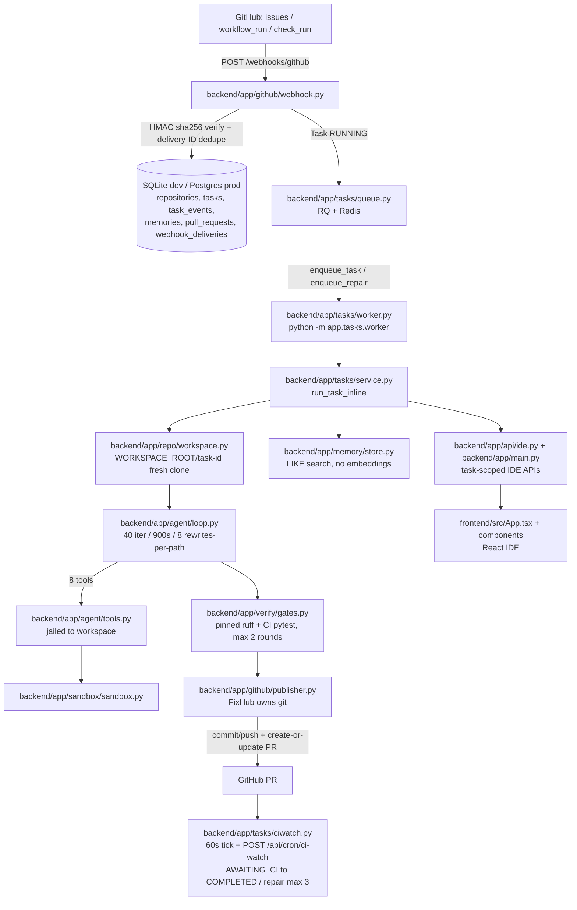

# FixHub architecture (current implementation)

This document describes the frozen implementation. File paths are exact. No legacy components are described here; deleted pre-simplification modules are intentionally omitted.

## Request flow

## Subsystems and contracts

### Webhook (`backend/app/github/webhook.py`)

- Verifies `X-Hub-Signature-256` (`sha256=` HMAC with `GITHUB_WEBHOOK_SECRET`), rejects missing delivery IDs, records `webhook_deliveries` to ignore redeliveries.
- `issues`: only `opened`/`reopened` create tasks. Optional `fixhub-fix` label is read but not required.
- `workflow_run`: only `completed` + `failure` creates tasks. `check_run`: only `completed` + `failure`.
- Duplicate CI deliveries for an already-`RUNNING` same repo+sha+job reuse the active task (`duplicate: active_task`).
- Builds structured CI context (`build_ci_context`: provider, workflow file/content, run ID, SHA, branch, job, step, annotations, changed files, URL) and persists `TASK_CREATED` + `CI_CONTEXT_LOADED` events.
- Auto-enqueues via `_maybe_enqueue` when `AUTO_RUN_ON_WEBHOOK=1`; otherwise records `QUEUE_FAILED` and leaves the task for manual `/run`.

### Queue and worker (`backend/app/tasks/queue.py`, `worker.py`)

- `enqueue_task(task_id)` and `enqueue_repair(task_id)` return `{enqueued, job_id?, error?}` and never raise. Missing/unreachable Redis returns `enqueued: False` so callers fall back to inline runs.
- `run_task_job` / `run_repair_job` are the RQ entrypoints and must stay importable.
- `job_failed` marks a still-`RUNNING` task `FAILED` with `job_crash` so jobs never wedge the queue.
- `queue_health()` powers `GET /api/queue/health` and the frontend worker pill.

### Task orchestration (`backend/app/tasks/service.py`)

- One attempt per task, no hidden retries. Retry explicitly via `POST /api/tasks/{id}/run`.
- Pre-agent stale check (CI only): if a green FixHub PR already touches the failing files, the task completes as `SUPERSEDED` without spending a run.
- Workspace: `clone_repo(source, task_id, branch?)` wipes `WORKSPACE_ROOT/task-{id}` first, clones, then for CI tasks checks out the exact failing SHA (`CI_CHECKOUT`, fallback to default branch when unreachable).
- Memory: generic overview plus CI-scoped retrieval (`_relevant_memory`, top 3 rows matching job/workflow/paths). CI failure text outranks stale memory.
- Agent: `run_agent(...)` with live `TOOL_CALL`/`FILE_CHANGED`/`COMMAND_RUN` persistence, cancel polling (`cancel_requested`), crash handling (LLM-blocked → `BLOCKED`; crash with real changes → `NEEDS_REVIEW` with workspace kept; crash without changes → `FAILED`).
- No-change finish → `COMPLETED` (`no_changes: True`).
- Stale-guard before publish: green upstream FixHub PR touching the same files wins (`SUPERSEDED`).
- Gates: `detect_gates` → `VALIDATION_STARTED` → `run_gates` → up to 2 follow-up agent rounds on `VALIDATION_FAILED` → `VALIDATION_PASSED` or `NEEDS_REVIEW` (`gate_failed`).
- Review gate: when `AUTO_PUBLISH=0`, stop at `NEEDS_REVIEW` (workspace kept); publish later via `approve_task()` / `POST /api/tasks/{id}/approve`.
- Publish: `_publish_task` enforces the branch-collision guard, resolves installation token, calls `publisher.publish` (or local commit+push when no token), records `COMMIT_CREATED`/`PR_CREATED`/`AWAITING_CI`, writes memory from the real diff + summary, then cleans the workspace unless `WORKSPACE_KEEP=1`.

### Agent loop (`backend/app/agent/loop.py`, `tools.py`, `paths.py`, `prompt.py`, `context.py`)

- `TaskContext` is built once per run (repository, trigger, issue/CI structs, branch, base commit, memory overview). The LLM never constructs workspace paths.
- System prompt (`prompt.py`) enforces repository-relative paths, per-call `cwd`, structured command results, failure discipline (never repeat an identical failed call), CI-first reading order, pinned toolchain, memory-as-background-only, and no self-managed git.
- Tools: 8 total, all jailed. `resolve()` rejects empty, NUL, absolute, `~`, drive-letter, and `..`-escaping paths. `is_sensitive()` blocks `.env`, `.git/*`, `*.pem`, `*.key`, secrets/tokens/credentials for read/write/search.
- `run_command(workspace, command, cwd)` runs with a fixed repo-relative cwd; results render as `exit_code` (authoritative, `null` only on timeout), `cwd`, `duration_ms`, `timed_out`, stdout/stderr sections.
- Loop policy: identical-success reuse (cached result), identical-failure block after 2 repeats with a strategy-change instruction, rewrite cap (8 per path), premature-done nudge (max 2), sliding window (`LLM_HISTORY_GROUPS=12`) with condensed summary of dropped spans.
- Cancel: `is_cancelled` checked every iteration and before every tool call → `LoopResult(cancelled=True)` → task `CANCELLED`.

### Sandbox (`backend/app/sandbox/sandbox.py`)

- Fail-closed: missing workspace → `SandboxBlockedError`, never host fallback.
- Env scrub removes `LLM_API_KEY`, `GITHUB_APP_PRIVATE_KEY`, `GITHUB_TOKEN`, `GH_TOKEN` from child processes. `register_secret()` / `redact()` scrub per-task installation tokens from all outputs.
- Denylist blocks `rm -rf /`, `mkfs`, `dd`, `shutdown`, `reboot`, fork bombs, `curl|sh` / `wget|sh`, `ssh`, `scp`, `> /dev/sd*`.
- Timeout uses process-group tree kill (`CREATE_NEW_PROCESS_GROUP` + `taskkill /F /T` on Windows, `killpg` on POSIX) to avoid pipe-inheritance deadlocks. Output capped at `TOOL_OUTPUT_MAX_BYTES` (20,000).

### Git ownership (`backend/app/github/publisher.py`, `client.py`, `app_auth.py`)

- Branch names embed the task ID: `fixhub-fixes/issue-<n>-task-<id>`, `fixhub-fixes/ci-<shortsha>-task-<id>`. Initial runs, gate rounds, repair rounds, and manual approve all resolve the same branch and reuse the same PR.
- `ensure_branch` handles local-exists (checkout + ff-only pull), remote-only (track-checkout), and create-from-`start` (failing CI SHA) else `origin/<base>` else local base else `HEAD`.
- `publish` commits as `fixhub <fixhub@fixhub.local>`, pushes `-u origin <branch>`, then reuses the open PR from that branch or creates one. `__pycache__` entries are unstaged before commit and excluded from `changed_files()` / `has_meaningful_changes()`.
- GitHub client is minimal `httpx`: create/update PR, list open pulls, failing-step/log excerpts and tails, check conclusions, annotations, workflow content, installation repos/issues. Auth is App JWT + installation tokens (`app_auth.py`); tokens are embedded in clone URLs and never logged.

### Verification gates (`backend/app/verify/gates.py`)

- `detect_ruff_version`: pinned `ruff==x.y.z` from requirements files, else `"latest"` when CI references ruff, else `None` (skip).
- `detect_gates`: `ruff` when Python files changed and a ruff gate exists; `pytest` when safe CI test commands exist.
- `_pytest_commands`: exact `run:` lines from `.github/workflows/*.yml` filtered to safe prefixes (`pytest`, `python -m pytest`, `ruff check`, `ruff format --check`, `mypy`) and excluding unsafe tokens (deploy, publish, push, release, `docker push`, `gh release`, `twine`, `npm publish`, `git push`, `kubectl`, `terraform apply`, `aws/az/gcloud`, `--fix`). Max 3 commands. Fallback runs changed test files when pytest is a dependency.
- `_pytest_gate` runs each command with a 300s sandbox timeout; missing-dependency output (`ModuleNotFoundError`, `No module named`, `ImportError` with no test summary) votes skip, not failure.
- `_ruff_gate` installs the pinned version (`python -m pip install -q ruff==x.y.z`) then runs `python -m ruff check` and `python -m ruff format --check` as single-purpose commands (no shell chaining, `python -m` for interpreter consistency).

### Memory (`backend/app/memory/store.py`)

- Tables: `memories(repository, path, summary, commit_sha, last_analyzed_rev)`. Special path `__overview__` holds the repo overview.
- `search_memory` is case-insensitive token overlap over `path + summary` (tokens longer than 2 chars, max 8). No embeddings; the schema allows adding an embedding column later without touching the loop.

### Workspaces (`backend/app/repo/workspace.py`)

- `WORKSPACE_ROOT/task-{id}` per task. `clone_repo` removes any existing tree first (Windows-robust retry), clones quietly, optionally checks out a branch. `checkout_ref` supports detached-SHA checkout for CI tasks. `head_sha` records the base/published commit. `destroy_workspace` is best-effort and skipped when `WORKSPACE_KEEP=1`.

### CI watcher (`backend/app/tasks/ciwatch.py`)

- `check_awaiting_ci()` iterates `AWAITING_CI` tasks; `_check_one` returns `completed` (green), `pending` (no token/SHA, API error, or non-terminal checks), `repair_enqueued` (failure, attempt ≤ 3, status back to `RUNNING` with `CI_FAILED` + `CI_REPAIR_STARTED` events), or `failed` (attempt > 3, `FAILED` with preserved tail).
- Triggered by a 60s daemon tick in `app/main.py` and manually via `POST /api/cron/ci-watch`. Never raises out of the top-level check.

### APIs and IDE (`backend/app/main.py`, `backend/app/api/ide.py`, `frontend/`)

- `main.py` mounts `github/webhook.py` + `api/ide.py`, creates tables on startup, sweeps stale `RUNNING` tasks (older than `JOB_TIMEOUT_S + 600s`) to `FAILED`, and starts the CI-watcher thread.
- Repository routes: `GET /api/repositories`, `POST /api/repositories/connect`, `GET /api/github/installations`, `GET /api/github/repos`, `GET /api/github/issues?repo=`, `POST /api/tasks/from-issue`.
- Task routes: `GET /api/tasks`, `GET /api/tasks/{id}` (summary + events + memory), `POST /api/tasks/{id}/run?sync=`, `POST /api/tasks/{id}/cleanup`, `POST /api/tasks/{id}/cancel`, `POST /api/cron/ci-watch`.
- IDE routes (`api/ide.py`, all task-workspace-scoped): files list, file read (offset/limit, 200KB cap), file save, diff (status + unified), events poll (`?after=`), verification view, terminal (sandboxed), chat append, chat SSE stream, approve-to-publish. Sensitive files return 403; expired workspaces return 410.
- Frontend (`frontend/src/`): `App.tsx` shell (left tasks/explorer/repos, center code/diff + terminal, right review/trace/chat), `api.ts` client, `types.ts` contracts, `components/DirTree.tsx`, `EditorTabs.tsx` (Monaco), `TerminalPanel.tsx` (xterm), `TraceView.tsx` (SSE + poll), `ReviewPanel.tsx`, `DiffView.tsx`, `ChatPanel.tsx`, `styles.css`. Build: `tsc --noEmit` + `vite build` → `dist/` served by nginx (`frontend/nginx.conf` proxies `/api/`, `/webhooks/`, `/health` to `backend:8000`).

### Persistence (`backend/app/db/`)

- `models.py`: `repositories`, `tasks` (issue + CI fields, branch/commit/PR, error, `ci_attempt_count`, `last_ci_failure`, `cancel_requested`), `task_events` (operational tool/git/validation/CI events; no chain-of-thought stored), `memories`, `pull_requests`, `webhook_deliveries`.
- SQLite dev (`sqlite:///./fixhub.db`, Docker shared path `sqlite:////srv/backend/data/fixhub.db`), Postgres prod string supported. No PG-only DDL.
